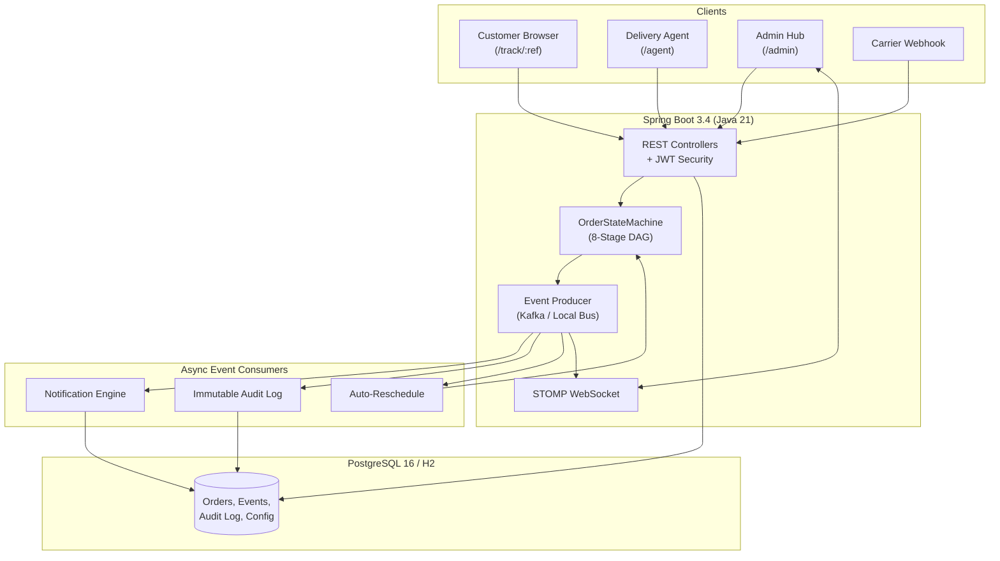
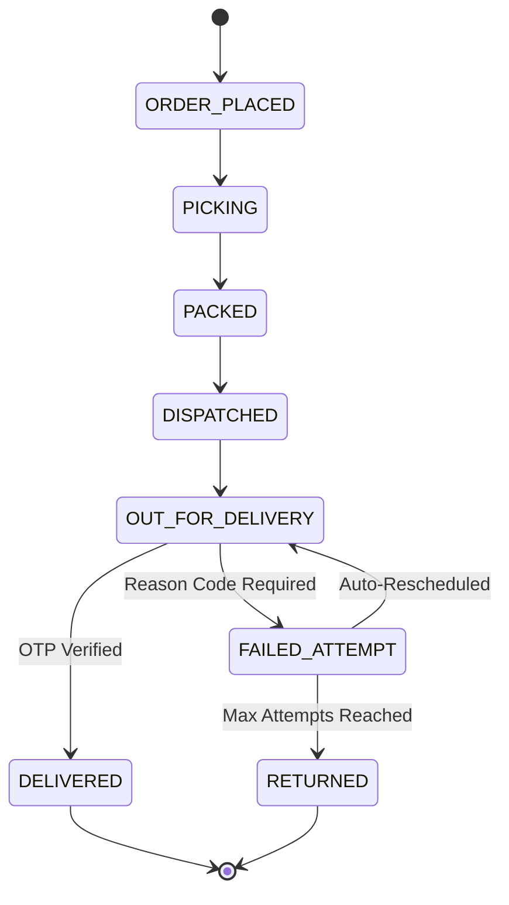

# EDOTS — Event-Driven Order Tracking System

> A production-grade, full-stack event-driven order lifecycle tracking platform built with Java 21, Spring Boot 3.4, Apache Kafka, PostgreSQL 16, and React 19 + TypeScript.
>
> **Built by [Meet Gandhi](https://github.com/meetpgandhi)** — Demonstrating event-driven architecture, finite state machines, real-time WebSocket push, and Spec-Driven Development (SDD).

---

## What This Project Demonstrates

This isn't a CRUD app with a fancy name. EDOTS showcases **real-world enterprise patterns** that production logistics systems use:

- **Finite State Machine** with strict transition enforcement — orders can't skip stages
- **Event-Driven Architecture** with Kafka (or synchronous in-memory bus for zero-dependency local mode)
- **CQRS-Lite** — write side publishes events, read side serves blazing-fast tracking queries
- **Cryptographic OTP Delivery Verification** — delivery agents can't fake deliveries
- **Constant-Time Webhook Authentication** — SHA-256 with `MessageDigest.isEqual` prevents timing attacks
- **Real-Time Admin Dashboard** — STOMP WebSocket push, not polling
- **Immutable Audit Log** — append-only event store with 90-day retention
- **Automated Business Logic** — failed delivery auto-rescheduling with configurable max attempts

---

## Architecture



### 8-Stage Order Lifecycle



---

## Tech Stack

| Layer | Technology |
|---|---|
| **Backend** | Java 21, Spring Boot 3.4, Spring Security + JWT, Spring WebSocket (STOMP) |
| **Messaging** | Apache Kafka (KRaft) — with zero-dependency local sync bus alternative |
| **Database** | PostgreSQL 16 (prod) / H2 in-memory (local) with Flyway migrations |
| **Frontend** | React 19, TypeScript 5.7, Vite 6, Tailwind CSS 4, Zustand, Recharts |
| **API Docs** | springdoc-openapi (Swagger UI) |
| **Testing** | JUnit 5, Mockito, Testcontainers |
| **Infra** | Docker Compose (PostgreSQL + Kafka KRaft + Spring Boot + Nginx) |

---

## Quick Start

### Option A: Local Mode (No Docker / Kafka / PostgreSQL needed)

**Terminal 1 — Backend:**
```bash
./gradlew :edots-api:bootRun --args='--spring.profiles.active=local'
```

**Terminal 2 — Frontend:**
```bash
cd frontend && npm install && npm run dev
```

Open `http://localhost:5173` — that's it.

### Option B: Full Stack (Docker)
```bash
docker compose up --build
```
Open `http://localhost:3000`.

### Default Credentials

| Role | Email | Password |
|---|---|---|
| Admin | `admin@edots.dev` | `admin123` |
| Agent | `agent1@edots.dev` | `agent123` |

Track orders without login at `/track/ORD-1003`.

---

## Project Structure (Gradle Multi-Module)

```
edots/
├── edots-domain/          # Domain models, state machine, repositories (zero framework deps)
├── edots-event-engine/    # Kafka producer/consumer, local sync event bus
├── edots-api/             # Spring Boot app, REST controllers, JWT security
├── edots-notification/    # Multi-channel notification engine (email/SMS/in-app simulation)
├── edots-webhook/         # Carrier webhook ingestion with SHA-256 auth
├── edots-scheduler/       # Stale order detection (48h), audit log retention (90d)
├── frontend/              # React 19 + TypeScript SPA
├── specs/                 # SDD artifacts (spec, plan, tasks, analysis)
└── docker-compose.yml     # Full stack orchestration
```

---

## Key Design Decisions

### Why a State Machine?
Orders can't jump from `ORDER_PLACED` to `DELIVERED`. The `OrderStateMachine` enforces a strict DAG with typed exceptions (`ILLEGAL_STAGE_TRANSITION`, `OTP_VERIFICATION_REQUIRED`, `EXCEPTION_REASON_REQUIRED`). This is tested with parameterized tests covering every valid AND invalid transition combination.

### Why Dual-Mode Event Dispatching?
Production uses Kafka. But for local development or demos, a `@Profile("local")` `LocalEventBus` synchronously calls the same consumer beans — zero external dependencies, identical behavior. The `LocalOrderEventProducer` is `@Primary` under the local profile and also broadcasts to WebSocket.

### Why Constant-Time Webhook Auth?
Carrier API keys are hashed with SHA-256 and compared using `MessageDigest.isEqual()` — not `String.equals()`. This prevents timing side-channel attacks on the webhook endpoint.

### Why Append-Only Events?
The `order_events` and `audit_log` tables have no UPDATE or DELETE operations anywhere in the codebase. Events are immutable. A scheduled retention job cleans up records older than 90 days.

---

## API Endpoints

| Method | Path | Auth | Description |
|---|---|---|---|
| GET | `/api/tracking/{ref}` | Public | Order status + timeline |
| GET | `/api/tracking/{ref}/events` | Public | Event history |
| POST | `/api/auth/login` | Public | JWT login |
| GET | `/api/agent/orders` | Agent | Assigned orders |
| POST | `/api/agent/orders/{id}/transition` | Agent | Stage transition |
| POST | `/api/agent/orders/{id}/otp/generate` | Agent | Generate OTP |
| POST | `/api/agent/orders/{id}/otp/verify` | Agent | Verify OTP |
| GET | `/api/admin/orders` | Admin | Filterable order queue |
| GET | `/api/admin/orders/stale` | Admin | 48h+ stale orders |
| CRUD | `/api/admin/notifications/rules` | Admin | Notification rules |
| GET | `/api/admin/audit-log` | Admin | Audit trail |
| POST | `/api/webhooks/carrier/{id}` | API Key | Carrier webhook |

Full interactive docs at `/swagger-ui/index.html`.

---

## Spec-Driven Development (SDD)

This project was built following strict SDD methodology. All planning artifacts are in `specs/`:

- `specs/constitution.md` — Engineering principles and standards
- `specs/spec.md` — Full feature specification (8 user stories)
- `specs/clarify.md` — Ambiguity resolution
- `specs/plan.md` — Architecture and API contracts
- `specs/checklist.md` — Quality validation checklist
- `specs/tasks.md` — Ordered implementation tasks
- `specs/analysis.md` — Cross-artifact consistency audit

---

## Running Tests

```bash
# Backend (JUnit 5 + Mockito)
./gradlew test

# Frontend (TypeScript compilation check)
cd frontend && npm run build
```

---

## License

MIT

---

*Built with Java 21, Spring Boot 3.4, Kafka, React 19, and a lot of event-driven enthusiasm.*
