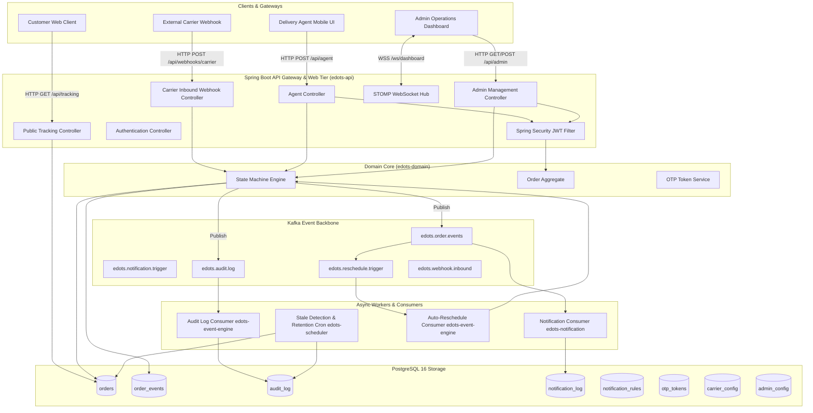

# EDOTS Technical Implementation Plan (specs/plan.md)

## 1. System Architecture Overview

---

## 2. Kafka Topic Architecture

| Topic Name | Purpose | Key | Message Type |
|---|---|---|---|
| `edots.order.events` | Published whenever any order transitions across 8 stages | `orderReference` | `OrderStageEvent` |
| `edots.notification.trigger` | Commands to evaluate rules and dispatch simulated notifications | `orderReference` | `NotificationTriggerCommand` |
| `edots.audit.log` | Asynchronous stream for immutable audit trail | `referenceId` | `AuditLogEntry` |
| `edots.webhook.inbound` | Inbound raw payloads from external carrier integrations | `carrierId` | `CarrierInboundPayload` |
| `edots.reschedule.trigger` | Triggered when stage transitions to `FAILED_ATTEMPT` | `orderReference` | `RescheduleTriggerEvent` |

### Producer & Consumer Configuration
- **Producer**: `acks=all`, idempotent producer (`enable.idempotence=true`), `retries=3`, string serializer for keys, JSON serializer (`Jackson2JsonSerializer`) for payloads.
- **Consumer**: `group-id` dedicated per module (`edots-notification-group`, `edots-audit-group`, `edots-reschedule-group`), offset reset `earliest`, concurrency `3`.

---

## 3. Database Schema & Flyway Plan

### Tables
1. `orders`:
   - `id` BIGSERIAL PRIMARY KEY
   - `order_reference` VARCHAR(50) UNIQUE NOT NULL
   - `customer_name` VARCHAR(255) NOT NULL
   - `customer_email` VARCHAR(255)
   - `customer_phone` VARCHAR(20)
   - `current_stage` VARCHAR(30) NOT NULL DEFAULT 'ORDER_PLACED'
   - `assigned_agent_id` BIGINT REFERENCES delivery_agents(id)
   - `carrier_id` VARCHAR(100)
   - `attempt_count` INT DEFAULT 0
   - `max_attempts` INT DEFAULT 3
   - `next_delivery_slot` TIMESTAMP
   - `created_at` TIMESTAMP NOT NULL DEFAULT NOW()
   - `updated_at` TIMESTAMP NOT NULL DEFAULT NOW()

2. `order_events`:
   - `id` BIGSERIAL PRIMARY KEY
   - `order_id` BIGINT NOT NULL REFERENCES orders(id)
   - `event_type` VARCHAR(50) NOT NULL
   - `previous_stage` VARCHAR(30)
   - `new_stage` VARCHAR(30) NOT NULL
   - `actor_id` VARCHAR(100) NOT NULL
   - `actor_type` VARCHAR(20) NOT NULL
   - `reason_code` VARCHAR(50)
   - `metadata` JSONB
   - `created_at` TIMESTAMP NOT NULL DEFAULT NOW()

3. `delivery_agents`:
   - `id` BIGSERIAL PRIMARY KEY
   - `name` VARCHAR(255) NOT NULL
   - `email` VARCHAR(255) UNIQUE NOT NULL
   - `phone` VARCHAR(20)
   - `password_hash` VARCHAR(255) NOT NULL
   - `active` BOOLEAN DEFAULT TRUE
   - `created_at` TIMESTAMP DEFAULT NOW()

4. `admin_users`:
   - `id` BIGSERIAL PRIMARY KEY
   - `name` VARCHAR(255) NOT NULL
   - `email` VARCHAR(255) UNIQUE NOT NULL
   - `password_hash` VARCHAR(255) NOT NULL
   - `role` VARCHAR(30) DEFAULT 'ADMIN'
   - `created_at` TIMESTAMP DEFAULT NOW()

5. `notification_rules`:
   - `id` BIGSERIAL PRIMARY KEY
   - `event_type` VARCHAR(50) NOT NULL
   - `channels` JSONB NOT NULL DEFAULT '["EMAIL"]'
   - `template_body` TEXT
   - `active` BOOLEAN DEFAULT TRUE
   - `created_by` BIGINT REFERENCES admin_users(id)
   - `created_at` TIMESTAMP DEFAULT NOW()
   - `updated_at` TIMESTAMP DEFAULT NOW()

6. `notification_log`:
   - `id` BIGSERIAL PRIMARY KEY
   - `order_id` BIGINT REFERENCES orders(id)
   - `customer_email` VARCHAR(255)
   - `channel` VARCHAR(20) NOT NULL
   - `event_type` VARCHAR(50) NOT NULL
   - `payload` JSONB
   - `status` VARCHAR(20) DEFAULT 'SENT'
   - `sent_at` TIMESTAMP DEFAULT NOW()

7. `otp_tokens`:
   - `id` BIGSERIAL PRIMARY KEY
   - `order_id` BIGINT NOT NULL REFERENCES orders(id)
   - `agent_id` BIGINT NOT NULL REFERENCES delivery_agents(id)
   - `otp_code` VARCHAR(6) NOT NULL
   - `expires_at` TIMESTAMP NOT NULL
   - `verified` BOOLEAN DEFAULT FALSE
   - `created_at` TIMESTAMP DEFAULT NOW()

8. `audit_log`:
   - `id` BIGSERIAL PRIMARY KEY
   - `event_type` VARCHAR(50) NOT NULL
   - `actor_id` VARCHAR(100) NOT NULL
   - `actor_type` VARCHAR(20) NOT NULL
   - `reference_id` VARCHAR(100)
   - `reference_type` VARCHAR(30)
   - `detail` JSONB
   - `created_at` TIMESTAMP NOT NULL DEFAULT NOW()

9. `carrier_config`:
   - `id` BIGSERIAL PRIMARY KEY
   - `carrier_id` VARCHAR(100) UNIQUE NOT NULL
   - `carrier_name` VARCHAR(255) NOT NULL
   - `api_key_hash` VARCHAR(255) NOT NULL
   - `stage_mapping` JSONB NOT NULL
   - `active` BOOLEAN DEFAULT TRUE
   - `created_at` TIMESTAMP DEFAULT NOW()

10. `admin_config`:
    - `id` BIGSERIAL PRIMARY KEY
    - `config_key` VARCHAR(100) UNIQUE NOT NULL
    - `config_value` VARCHAR(500) NOT NULL
    - `updated_by` BIGINT REFERENCES admin_users(id)
    - `updated_at` TIMESTAMP DEFAULT NOW()

### Indexes
- `CREATE INDEX idx_orders_ref ON orders(order_reference);`
- `CREATE INDEX idx_orders_stage ON orders(current_stage);`
- `CREATE INDEX idx_orders_agent ON orders(assigned_agent_id);`
- `CREATE INDEX idx_orders_updated_at ON orders(updated_at);`
- `CREATE INDEX idx_order_events_order_time ON order_events(order_id, created_at);`
- `CREATE INDEX idx_audit_log_created_at ON audit_log(created_at);`
- `CREATE INDEX idx_audit_log_ref_id ON audit_log(reference_id);`
- `CREATE INDEX idx_notification_log_order ON notification_log(order_id);`

---

## 4. REST API Endpoint Specifications

### Authentication
- `POST /api/auth/login`: `{ email, password }` → `{ accessToken, role, name, id }`
- `POST /api/auth/refresh`: `{ refreshToken }` → `{ accessToken }`

### Public Customer Tracking
- `GET /api/tracking/{orderReference}`: Current order details, status, agent details if in delivery.
- `GET /api/tracking/{orderReference}/events`: List of chronological events.

### Delivery Agent
- `GET /api/agent/orders`: List of orders assigned to calling agent.
- `POST /api/agent/orders/{id}/transition`: Submit transition (`newStage`, optional `reasonCode`).
- `POST /api/agent/orders/{id}/otp/generate`: Generates OTP code.
- `POST /api/agent/orders/{id}/otp/verify`: Submit `{ otpCode }`.

### Admin Management
- `GET /api/admin/orders`: Search/filter (`stage`, `carrier`, `agent`, `from`, `to`, `page`, `size`).
- `GET /api/admin/orders/stale`: Returns orders inactive for 48+ hours.
- `GET /api/admin/notifications/rules`: List rules.
- `POST /api/admin/notifications/rules`: Create rule.
- `PUT /api/admin/notifications/rules/{id}`: Update rule.
- `DELETE /api/admin/notifications/rules/{id}`: Soft-delete/deactivate rule.
- `GET /api/admin/audit-log`: Filtered audit records.
- `GET /api/admin/dashboard/stats`: KPI aggregations (total orders, counts per stage, stale counts, today events).

### Carrier Webhook
- `POST /api/webhooks/carrier/{carrierId}`: Requires `X-Api-Key` header. Maps external status to EDOTS stage.

### WebSocket
- STOMP destination: `/topic/dashboard-events` (broadcasts new `OrderStageEvent` records for live UI refresh).

---

## 5. Security & Error Handling Strategy
- **Security**: Stateless Spring Security JWT filter. BCrypt password encryption. `SecurityFilterChain` permitting public endpoints (`/api/tracking/**`, `/api/auth/**`, `/api/webhooks/**`, `/swagger-ui/**`, `/v3/api-docs/**`) while securing `/api/agent/**` with `ROLE_AGENT` and `/api/admin/**` with `ROLE_ADMIN`.
- **Global Error Handling**: `@RestControllerAdvice` mapping domain exceptions (`InvalidStateTransitionException`, `OtpVerificationException`, `ResourceNotFoundException`) to RFC 7807 `ProblemDetail` with appropriate HTTP status codes (400, 401, 403, 404, 409, 422).
